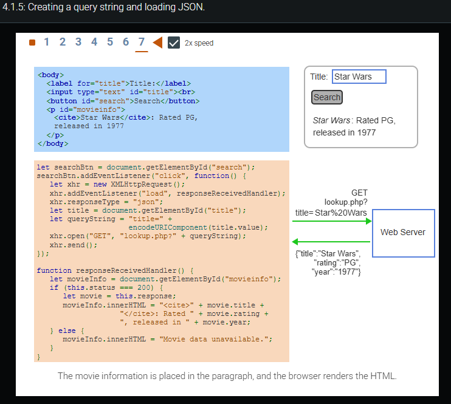
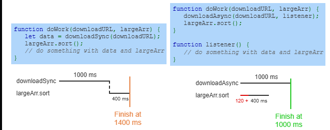
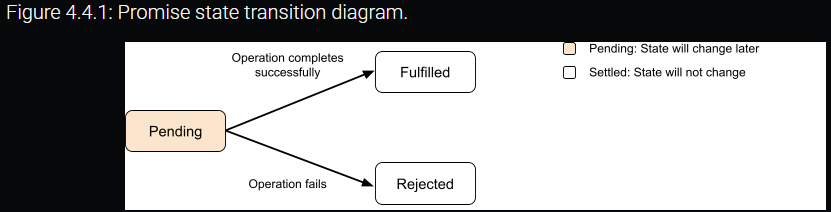
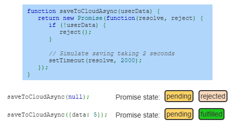
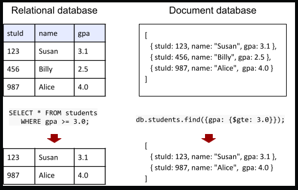
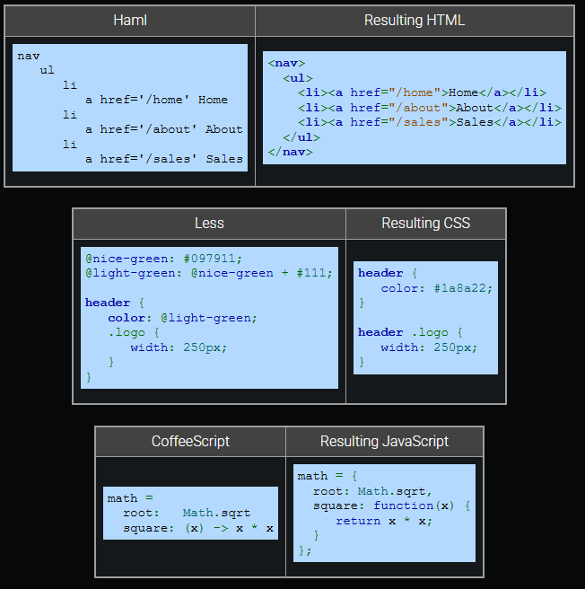

### Window object

JavaScript running in a web browser has access to the window object, which represents an open browser window. In a tabbed browser, each tab has a `window` object. The `document` object is a property of the `window` object and can be accessed as `window.document` or just `document`. Other properties of the `window` object include:

- window.location is a location object that contains information about the window's current URL. Ex: `window.location.hostname` is the URL's hostname.

- window.navigator is a navigator object that contains information about the browser. Ex: `window.navigator.userAgent` returns the browser's user agent string.

- window.innerHeight and window.innerWidth are the height and width in pixels of the window's content area. Ex: `window.innerWidth` returns 600 if the browser's content area is 600 pixels wide.

The `window` object defines some useful methods:

- window.alert() displays an alert dialog box. Ex: `window.alert("Hello")` displays a dialog box with the message "Hello".

- window.confirm() displays a confirmation dialog box with OK and Cancel buttons. `confirm()` returns true if OK is pressed and false if Cancel is pressed. Ex: `window.confirm("Are you sure?")` displays a dialog box with the question.

- window.open() opens a new browser window. Ex: `window.open("https://www.twitter.com/")` opens a new browser that loads the Twitter webpage.
-

The browser provides a `console` object with a defined set of methods, or API, that the `console` object supports. An API (Application Programming Interface) is a specification of the methods and objects that defines how a programmer should interact with software components. The console API includes the following methods:

- console.log() displays informational data to the console.

- console.warn() displays warnings to the console. The browser usually has a special indicator to differentiate a warning from the standard log message. Ex: A yellow warning box.

- console.error() displays errors to the console. The browser usually has a special indicator to differentiate an error from a warning or the standard log message. Ex: A red error box.

- console.dir() displays a JavaScript object to the console. The browser usually supports a method for compactly representing the object. Ex: A hierarchical tree representation allowing a developer to expand and collapse the object contents.

Good practice is to use `<script>` elements to load JavaScript from an external file rather than writing the JavaScript directly within the HTML file. The `<script>` element's `src` attribute specifies a JavaScript file to load.

Example 2.7.1: Loading JavaScript from an external file.

---------------------------------------------------------

```
<script src\="bootstrap.js"\></script\>

```

Feedback?

A common error when loading an external JavaScript file is to forget the closing `</script>` tag or trying to use a self-closing `<script />` tag as in `<script src="bootstrap.js" />`. All modern browsers require a closing `</script>` tag.

### Loading JavaScript with async and defer

Although the `<script>` element can be included anywhere in the head or body, good practice is to include the `<script>` element in the head with the `async` or `defer` attributes set.

The `<script>` element's async attribute allows the browser to process the webpage concurrently with loading and processing the JavaScript.

The `<script>` element's defer attribute allows the browser to load the webpage concurrently with loading the JavaScript, but the JavaScript is not processed until the webpage is completely loaded.

To reduce the amount of JavaScript that must be downloaded from a web server, developers often minify a website's JavaScript. Minification or minimization is the process of removing unnecessary characters (like whitespace and comments) from JavaScript code so the code executes the same but with fewer characters. Minification software may also rename identifiers into shorter ones to reduce space. Ex: `let totalReturns = 10;` may be converted into `let a=10;`.

Minified JavaScript is typically stored in a file with a ".min.js" file extension. An example of minified code from the [Bootstrap project](http://getbootstrap.com/getting-started/) is shown below.

```
// Excerpt from bootstrap.min.js
a.fn.button\=b,a.fn.button.Constructor\=c,a.fn.button.noConflict\=function(){
return a.fn.button\=d,this},a(document).on("click.bs.button.data-api",
'\[data-toggle^="button"\]',function(c){let d\=a(c.target).closest(".btn");
b.call(d,"toggle"),a(c.target).is('input\[type\="radio"\],

```

A JavaScript obfuscator is software that converts JavaScript into an unreadable form that is very difficult to convert back into readable JavaScript. Developers obfuscate a website's JavaScript to prevent the code from being read or re-purposed by others. Obfuscated code may also be minified and appear in a ".min.js" file.

Exploring further:

- [Window object](https://developer.mozilla.org/en-US/docs/Web/API/Window) from MDN
- [Console object](https://developer.mozilla.org/en-US/docs/Web/API/Console) from MDN
- [async vs defer attributes](http://www.growingwiththeweb.com/2014/02/async-vs-defer-attributes.html) from Growing with the Web
- JavaScript minifiers: [javascript-minifier.com](https://javascript-minifier.com/) and [jscompress.com](https://jscompress.com/)
- JavaScript obfuscators: [javascriptobfuscator.com](https://javascriptobfuscator.com//) and [JS-obfus](http://stunnix.com/prod/jo/)

## 2.9 Document Object Model (DOM)

### DOM structure

The Document Object Model (DOM) is a data structure corresponding to the HTML document displayed in a web browser. A DOM tree is a visualization of the DOM data structure. A node is an individual object in the DOM tree. Nodes are created for each element, the text between an element's tags, and the element's attributes.

- The root node is the node at the top of the DOM.
- A child node is the node directly under another node. A node can have zero, one, or more child nodes (children).
- A parent node is the node directly above another node. All nodes, except the root node, have one parent node.

Viewing the DOM in Chrome

--------------------------

The Chrome DevTools can display an HTML document's DOM by pressing Ctrl+Shift+C on Windows or Ctrl+Option+C on a Mac. The DOM may differ from the HTML. Ex: The `<head>` element may be missing from the HTML file but is visible in the DOM below because `<meta>` and `<title>` elements are always placed in the `<head>` element.


### Searching the DOM

JavaScript is commonly used to search the DOM for a specific node or set of nodes and then change the nodes' attributes or content. Ex: In an email application, the user may click a Delete button to delete an email. The JavaScript must search the DOM for the node containing the email's contents and then change the contents to read "Email deleted".

The `document` object provides five primary methods that search the DOM for specific nodes:

1. The document.getElementById() method returns the DOM node whose `id` attribute is the same as the method's parameter.
    Ex: `document.getElementById("early_languages")` returns the p node in the HTML below.

2. The document.getElementsByTagName() method returns an array of all the DOM nodes whose type is the same as the method's parameter.
    Ex: `document.getElementsByTagName("li")` returns an array containing the four li nodes from in the HTML below.

3. The document.getElementsByClassName() method returns an array containing all the DOM nodes whose `class` attribute matches the method's parameter.
    Ex: `document.getElementsByClassName("traditional")` returns an array containing the `ol` node with the `class` attribute matching the word traditional.

4. The document.querySelectorAll() method returns an array containing all the DOM nodes that match the CSS selector passed as the method's parameter.
    Ex: `document.querySelectorAll("li a")` returns an array containing the two anchor nodes in the HTML below.

5. The document.querySelector() method returns the first element found in the DOM that matches the CSS selector passed as the method's parameter. `querySelector()` expects the same types of parameters as `querySelectorAll()` but only returns the first element found while navigating the DOM tree in a depth-first traversal.
    Ex: `document.querySelector("li")` returns the li node about Fortran.

A DOM search method name indicates whether the method returns one node or an array of nodes. If the method name starts with "getElements" or ends in "All", then the method returns an array, even if the array contains one node or is empty. `getElementById()` and `querySelector()` either return a single node or null if no node matches the method arguments.

### Modifying DOM node attributes

After searching the DOM for an element, JavaScript may be used to examine the element's attributes or to change the attributes. By modifying attributes, JavaScript programs can perform actions including:

- Change which image is displayed by modifying an img element's `src` attribute.
- Determine which image is currently displayed by reading the img element's `src` attribute.
- Change an element's CSS styling by modifying an element's `style` attribute.

Every attribute for an HTML element has an identically named property in the element's DOM node. Ex: `<a href="https://www.nasa.gov/" id="nasa_link">NASA</a>` has a corresponding DOM node with properties named `href` and `id`. Each attribute property name acts as both a getter and a setter.

- Getter: Using the property name to read the value allows a program to examine the attribute's value. Ex: `nasaUrl = document.getElementById("nasa_link").href` assigns `nasaUrl` the string `"https://www.nasa.gov/"` from the anchor element's `href` attribute.

- Setter: Writing to a property allows a program to modify the attribute, which is reflected in the rendered webpage. Ex: `document.getElementById("nasa_link").href = "https://www.spacex.com/"` changes the element's hyperlink to the SpaceX URL.

An element's attribute can be removed using the element method removeAttribute(). Ex: `document.getElementById("nasa_link").removeAttribute("href")` removes the link from the anchor element so that clicking on the HTML element no longer performs an action.

### Modifying DOM node content

After searching the DOM for an element, JavaScript may be used to examine or change the element's content.

Two common properties are used to get or set an element's content:

1. The textContent property gets or sets a DOM node's text content. Ex: `document.querySelector("p").textContent = "$25.99";` changes the paragraph to `<p>$25.99</p>`.

2. The innerHTML property gets or sets a DOM node's content, including all of the node's children, using an HTML-formatted string. Ex: `document.querySelector("p").innerHTML = "<strong>$25.99</strong>";` changes the paragraph to `<p><strong>$25.99</strong></p>`.

The `innerHTML` property uses an internal parser to create any new DOM nodes. `textContent`, however, only creates or changes a single text node. For setting an element's text, `textContent` is somewhat faster than `innerHTML` because no HTML parsing is performed.

Less common ways to change node content

----------------------------------------

The nodeValue property gets or sets the value of text nodes. As the DOM tree represents textual content separately from HTML elements, the textual content of an HTML element is the first child node of the HTML element's node. So, to access the textual content of an HTML element within the DOM, `firstChild.nodeValue` is used to access the value of the HTML's element's first child.

Ex: `document.getElementById("saleprice").firstChild.nodeValue = "$25.99"`:

1. Gets the DOM node for the element with id "saleprice".
2. Uses `firstChild` to access the textual content node for the element.
3. Uses `nodeValue` to update the content.

The innerText property gets or sets a DOM node's rendered content. `innerText` is similar to `textContent`, but `innerText` is aware of how text is rendered in the browser. Ex: In `<p>Testing   one</p>`, `textContent` returns "Testing    one" with spaces, but `innerText` returns "Testing one" with the spaces collapsed into a single space.

Modify the DOM nodes.

----------------------

An HTML element using the hidden attribute is not displayed by the web browser.

Add JavaScript in the `changePage()` function so that clicking on the Use Current Astronomy button does the following:

1. Uses `removeAttribute()` to remove the `hidden` attribute from the paragraph with the id `p2`, causing the paragraph to become visible.

2. Uses the `textContent` property of the span with id `lastPlanet` to change the name of the farthest planet to "Neptune".

3. Uses the `innerHTML` property of the paragraph with id `p4` to add a link: `<a href="https://en.wikipedia.org/wiki/Pluto">Source</a>`

Use an appropriate DOM search method like `document.getElementById()` to access the DOM nodes.

--- START FILE: HTML ---

```html
<body>
   <h1>The farthest planet</h1>

   <p id="p1">Pluto was discovered in 1930 and designated as a planet.</p>
   <p id="p2" hidden>In 2006, Pluto was reclassified as a dwarf planet.</p>
   <p id="p3"><span id="lastPlanet">Pluto</span> is the farthest planet from the Sun.</p>
   <p id="p4"></p>

   <input type="button" value="Use Current Astronomy">
</body>
```

--- END FILE: HTML ---

--- START FILE: JavaScript ---

const button = document.getElementsByTagName["input"](0);
button.addEventListener("click", changePage);

function changePage() {
   let p = document.getElementById("p2");
   p.removeAttribute("hidden");
  
   let span = document.getElementById("lastPlanet");
   span.textContent = "Neptune";

   p = document.getElementById("p4");
   p.innerHTML = '<a href="https://en.wikipedia.org/wiki/Pluto">Source</a>';
}

--- END FILE: JavaScript ---

### Accessing nodes

The JavaScript object document.documentElement is the root of the DOM tree. Ex: `let html = document.documentElement;` assigns the `html` variable with the HTML document's root node.

DOM nodes have properties for accessing a node's parent, children, and siblings:

1. The parentNode property refers to the node's parent. Ex: In the figure below, the ol node is the `parentNode` for all li nodes.

2. The childNodes property is an array-like collection of objects for each of the node's children. Ex: In the figure below, the li nodes and whitespace text nodes are the ol node's `childNodes`.

3. The children property is similar to the `childNodes` except the array contains only element nodes and no text nodes. Ex: In the figure below, the li nodes are the ol node's `children`.

4. The nextElementSibling property refers to the element node with the same parent following the current node in the document. Ex: In the figure below, the ol node is the p node's `nextElementSibling`.

5. The previousElementSibling property refers to the element node with the same parent preceding the current node in the document. Ex: In the figure below, the p node is the ol node's `previousElementSibling`.

A common error is to use the `childNodes` property instead of the `children` property when iterating through the items of a list. The `children` property only contains the list items, while the `childNodes` property also contains the whitespace text nodes between the list items.

### Modifying the DOM structure

Various DOM node methods can change a node's location within the DOM or remove nodes:

- The appendChild() method appends a DOM node to the object's child nodes. The code below moves the ordered list's first list item to the last list item of the same ordered list.

    ```
    ol \= document.getElementsByTagName("ol")\[0\];
    li \= ol.getElementsByTagName("li")\[0\];
    ol.appendChild(li);

    ```

- The insertBefore() method inserts a DOM node as a child node before an object's existing child node. The code below moves the ordered list's first list item before the fourth list item.

    ```
    ol \= document.getElementsByTagName("ol")\[0\];
    items \= ol.getElementsByTagName("li");
    ol.insertBefore(items\[0\], items\[3\]);

    ```

- The removeChild() method removes a node from the object's children. The most common usage pattern is to get a DOM node, n, and call `removeChild()` on n's parent passing n as an argument. Ex: `n.parentNode.removeChild(n)`

The following methods are for creating new nodes or duplicating existing nodes:

- The `document` method createElement() returns a new element node, created from a string argument that names the HTML element. Ex: `document.createElement("p")` creates a new paragraph node.

- The `document` method createTextNode() returns a new text node containing the text specified by a string argument. Ex: `document.createTextNode("Hello there!")` creates the text node with "Hello there!", which can then be appended to an element node.

- The node method cloneNode() returns an identical copy of a DOM node. The method's boolean argument indicates whether the method should also clone the node's children. Ex: `x.cloneNode(true)` creates an identical tree rooted at x, but `x.cloneNode(false)` creates only a single node identical to x. A common error is to forget to modify any id attributes in the cloned tree. The `cloneNode()` method does not ensure that new nodes have unique id attributes.

After creating or cloning a node, the node does not appear in the webpage until the node is attached to the DOM tree. A programmer must use `appendChild()` or `insertBefore()` to add the new node to the existing DOM tree.

## 2.11 Event-driven programming

### Events and event handlers

An event is an action, usually caused by a user, that the web browser responds to. Ex: A mouse movement, a key press, or a network response from a web server. Typically, the occurrence and timing of an event are unpredictable, since the user or web server can perform an action at any time.

Event-driven programming is a programming style where code runs only in response to various events. Code that runs in response to an event is called an event handler or event listener.

The web browser supports event-driven programming to simplify handling the many events a webpage must process. When an event happens, the browser calls the event's specified handlers. The web browser internally implements the code for detecting events and executing event handlers.

The example below modifies an input's `style` property, which sets the element's inline CSS styles. The input's border color changes colors when the input receives the focus or when focus is removed.

```html
<p>
   <label for="name">Name:</label>
   <input type="text" id="name">   
</p>
<p>
   <label for="answer">Answer:</label>
   <input type="number" id="answer">
</p>
```

```js
let inputs = document.querySelectorAll("input");

for (let i = 0; i < inputs.length; i++) {
   let input = inputs[i];
   input.style.border = "1px solid red";
   input.addEventListener("focus", function() {
      this.style.border = "1px solid green";
   });
   input.addEventListener("blur", function() {
      this.style.border = "1px solid blue";
   });
}
```

The following are events for which web developers commonly write handlers:

- A change event is caused by an element value being modified. Ex: Selecting an item in a radio button group causes a change event.

- An input event is caused when the value of an input or textarea element is changed.

- A load event is caused when the browser completes loading a resource and dependent resources. Usually load is used with the body element to execute code once all the webpage's CSS, JavaScript, images, etc. have finished loading.

- A DOMContentLoaded event is caused when the HTML file has been loaded and parsed, although other related resources such as CSS, JavaScript, and image files may not yet be loaded.

- A focus event is caused when an element becomes the current receiver of keyboard input. Ex: Clicking in an input field causes a focus event.

- A blur event is caused when an element loses focus and the element will no longer receive future keyboard input.

- A submit event is caused when the user submits a form to the web server.

### Registering event handlers

Handlers are written in three ways:

1. Embedding the handler as part of the HTML. Ex: `<button onclick="clickHandler()">Click Me</button>` sets the click event handler for the button element by using the `onclick` attribute. The attribute name used to register the handler adds the prefix "on" to the event name. Ex: The attribute for a mousemove event is `onmousemove`. Embedding a handler in HTML mixes content and functionality and thus should be avoided whenever possible.

2. Setting the DOM node event handler property directly using JavaScript. Ex: `document.querySelector("#myButton").onclick = clickHandler` sets the click event handler for the element with an id of "myButton" by overwriting the `onclick` JavaScript property. Using DOM node properties is better than embedding handlers within the HTML but has the disadvantage that setting the property only allows one handler for that element to be registered.

3. Using the JavaScript addEventListener() method to register an event handler for a DOM object. Ex: `document.querySelector("#myButton").addEventListener("click", clickHandler)` registers a click event handler for the element with the id "myButton". Good practice is to use the  `addEventListener()` method whenever possible, rather than using element attributes or overwriting JavaScript properties. The `addEventListener()` method allows for separation of content and functionality and allows multiple handlers to be registered with an element for the same event.

Every handler has an optional event object parameter that provides details of the event. Ex: For a keyup event, the event object indicates which key was pressed and released, or for a click event, which element was clicked.

In the animation below, `keyupHandler()` uses `event.target` to access the text box object where the keyup event occurred. Inside an event handler, the `this` keyword refers to the element to which the handler is attached. So `event.target` and `this` both refer to the text box object in the event handler.

```html
<!DOCTYPE html>
<html>
  <title>Keyup Demo</title>
  <script>
    function loadedHandler() {        
   let textBox = document.querySelector("#name");
   textBox.addEventListener("keyup", keyupHandler);
}
        
    function keyupHandler(event) {
   if (event.key == "Enter") {
      let textBox = event.target;
      alert("Hello, " + textBox.value + "!");
   }
}
  </script>
  <body>
    <label for="id">Name?</label>
    <input type="text" id="name">
  </body>        
</html>
```

### Capturing, at target, and bubbling phases

When an event occurs, the browser follows a simple DOM traversal process to determine which handlers are relevant and need to be called. The DOM traversal process has three phases: capturing, at target, and bubbling.

1. In the event capturing phase, the browser traverses the DOM tree from the root to the event target node, at each node calling any event-specific handlers that were explicitly registered for activation during the capturing phase.

2. In the at target phase, the browser calls all event-specific handlers registered on the target node.

3. In the event bubbling phase, the browser traverses the DOM tree from the event target node back to the root node, at each node calling all event-specific handlers registered for the bubbling phase on the current node.

The optional third parameter for the `addEventListener()` method indicates whether the handler is registered for the capturing phase or bubbling phase. If the third parameter is `false` or not specified, or if the event handler is registered using any other mechanism, the browser registers the handler for the event bubbling phase. If the parameter is `true`, the browser registers the handler for the capturing phase.

Some events do not bubble, such as blur, focus, and change. When a non-bubbling event occurs, the browser will follow the event capturing phase, the at target phase, and then stop.

### Preventing default behavior

The event capturing and bubbling process can be stopped by calling the stopPropagation() method on the event object provided to the handler. Once `stopPropagation()` is called, the browser stops the traversal process but still calls relevant registered handlers on the current node.

A web developer may want to prevent the browser from using a built-in handler for an event. Ex: Whenever a user clicks a form's submit button, the web browser sends the form data to the web server. The event object's preventDefault() method stops the web browser from performing the built-in handler. The built-in handlers that are often prevented are clicking elements, submitting forms, and moving the mouse into or out of an element.

The example below uses two event handlers for the password textbox:

1. `preventSpaces()` is a keydown event handler that listens for key presses. If the space key is pressed, `event.preventDefault()` stops the space from appearing in the textbox.

2. `checkPassword()` is an input event handler that is called when the password input changes. `checkPassword()` displays Weak, Stronger, Moderate, or Strong in the `<span>` element depending on various criteria for the password.

Exploring further:

- [Event reference](https://developer.mozilla.org/en-US/docs/Web/Events) from MDN
- [EventTarget.addEventListener()](https://developer.mozilla.org/en-US/docs/Web/API/EventTarget/addEventListener) from MDN
- [Event flow tutorial](http://www.java2s.com/Tutorials/Javascript/DOM_Event/Event_Flow_capture_target_and_bubbling_in_Javascript.htm) from Java2s

## 3.1 Classes

### Constructor functions

A JavaScript class is a special function, called a constructor function, that defines properties and methods from which an object may inherit. A constructor function is a function that initializes a new object when an object is instantiated with the `new` operator. The this keyword refers to the current object and is used to access properties inside the class.

### Prototype object

Every JavaScript object is associated with a second object called the prototype. The prototype object contains properties that an associated object inherits when the associated object is created.

When an object is instantiated with the `new` keyword, the object is assigned the `prototype` property that is associated with the constructor function. Ex: When a date object is instantiated with `new Date()`, the date object is assigned the `Date.prototype` from the `Date` constructor function. All date objects have access to the same methods like `getDate()` and `getYear()` because `getDate()` and `getYear()` are methods assigned to `Date.prototype`.

Developers often assign methods to the class' `prototype` instead of the constructor function because prototype methods are more memory efficient. The JavaScript interpreter must allocate memory for each method defined in a constructor function, but a prototype method is only allocated memory once and is shared by all objects created with the same constructor function.

### Private properties and closures

A private property is a property that is only accessible to object methods but is not accessible from outside the class. Private properties may be simulated in JavaScript by creating local variables in a constructor function with getters and setters to get and set the properties.

Figure 3.1.2: Creating a private property called "secret" with a getter and setter.

```js
function Person(name, age) {
   this.name = name;
   this.age = age;

   // private
   let secret;

   // public methods have access to private properties
   this.setSecret = function(s) {
      secret = s;
   };

   this.getSecret = function() {
      return secret;
   };
};

let bob = new Person("Bob", 21);
bob.setSecret("I have mutant powers!");
console.log(bob.getSecret());   // I have mutant powers!
console.log(bob.secret);        // undefined
```

Private class variables can be simulated in JavaScript because of closures. A closure is a special object that is automatically created and maintains a function's local variables and values after the function has returned. The `secret` variable defined in the `Person` constructor function above is remembered because of a closure that remembers the `Person` constructor function's local variables.

### Inheritance

Inheritance creates a new child class that adopts properties of a parent class. Ex: A Student class (child) may inherit from a Person class (parent), so a Student class has the same properties of a Person and may add even more properties.

Implementing inheritance in JavaScript is more complicated than most other programming languages. For a child class to inherit from a parent class, 3 operations must be performed:

1. The child class calls the parent class' constructor function from the child's constructor function using the `call()` method.

2. The Object.create() method copies the parent's prototype, and the new copy is assigned to the child's prototype to give the child class the same functionality as the parent class.

3. The child class' `prototype.constructor` is explicitly set to the child's constructor function.

```js
// Parent class
function Person(name) {
  this.name = name;
}

Person.prototype.sayHello = function() {
  console.log("Hello. My name is " + this.name);
};
Person.prototype.sayGoodbye = function() {
  console.log("Goodbye!");
};

// Child class
function Student(name, gpa) {   
  Person.call(this, name);
  this.gpa = gpa;
}

// Duplicate functionality of parent
Student.prototype = Object.create(Person.prototype);
Student.prototype.constructor = Student;

// Replace the parent's sayHello with a new method
Student.prototype.sayHello = function() {
  console.log("Hi, I'm " + this.name + " with a "
      + this.gpa + " GPA!");
}


let bob = new Student("Bob", 3.5);
bob.sayHello();
bob.sayGoodbye();

```

3.1.8: Practice with inheritance and private properties.

The JavaScript code defines a `Game` class and two methods.

1. Add a `VideoGame` class and all the necessary code so `VideoGame` inherits from the `Game` class.

2. Add a private variable to the `VideoGame` class called `totalPoints`, and initialize `totalPoints` to 0.

3. Add a getter method called `getScore()` to get the `totalPoints` variable.

4. Add a method called `addToScore(points)` that adds the `points` to `totalPoints`.

5. Instantiate a new `VideoGame` object with the title "Pac-Man". Call the appropriate methods to:

    1. Start playing the game.
    2. Show the score (should be 0).
    3. Add 20 points.
    4. Add 50 points.
    5. Show the score (should be 70).
    6. Stop playing the game.

```js
function Game(title) {
  this.title = title;  
}

Game.prototype.startPlaying = function() {
  console.log("Now playing " + this.title + "!");
};

Game.prototype.stopPlaying = function() {
  console.log("Taking a break.");
};

function VideoGame(title) {
   Game.call(this, title);
   
   let totalPoints = 0;
   
   this.getScore = function() {
      return totalPoints;
   };
   
   this.addToScore = function(score) {
      totalPoints += score;
   };
}
VideoGame.prototype = Object.create(Game.prototype);
VideoGame.prototype.constructor = VideoGame;

let game1 = new VideoGame("Pac-Man");
game1.startPlaying();
console.log(game1.getScore());
game1.addToScore(50);
console.log(game1.getScore());
game1.stopPlaying();

```

Console output:

```cmd
Now playing Pac-Man!
0
50
Taking a break.
```

## 3.2 Classes (ES6)

### Classes in EcmaScript 6

EcmaScript 6 (ES6) simplifies class declarations, introducing syntax that looks more familiar to a Java or C# programmer. Although the syntax is different, the underlying prototype model is not changed.

A class is declared by using the **class keyword** followed by a class name. The class is implemented by declaring methods within braces. Each method declaration is similar to a function declaration, but without the `function` keyword. The method name constructor() is reserved for the class constructor.

### Inheritance in ES6

The **extends keyword** allows one class to inherit from another. In the inheriting class' constructor, calling the **super()** function calls the parent class' constructor. `super()` must be called before using the `this` keyword in the inheriting class' constructor.

### Getters and setters

A class method declaration preceded by the **get keyword** defines a getter method for a property. A class method declaration preceded by the **set keyword** defines a setter method for a property. Defining either a getter or setter method named X, adds a property named X to each class instance. Ex: A `Square` class may have a getter method declared as:

```js
get area() {
   return this.width * this.height;
}
```

After creating a Square instance named s1, the expression s1.area, without parentheses, gets the square's area.
A get method must not have parameters. A set method must have one parameter. A property can be defined via a getter only, a setter only, or both a getter and setter.

A **static method** is a method that can be called without creating an instance of the class. A static method is declared with the **static** keyword preceding the method name. The method is called with the syntax: `ClassName.methodName(arguments)`.

Exploring further:

- [Classes (MDN)](https://developer.mozilla.org/en-US/docs/Web/JavaScript/Reference/Classes)

### 3.3 Classes (ES13)

### Classes in EcmaScript 2022

EcmaScript 2022 (ES13) introduces class syntax that differs in some ways from earlier versions of EcmaScript. Although the syntax is different, the underlying prototype model is not changed.

A class is declared by using the **class keyword** followed by a class name. The class is implemented by declaring fields and methods within braces. A **field** is a variable that stores data for a class. Each method declaration is similar to a function declaration, but without the `function` keyword. The method name **constructor()** is reserved for the class constructor.

### Private fields and methods

By default, fields and methods are public, meaning the fields and methods are accessible from outside the class. Fields and methods can be made private, or inaccessible from outside the class, by prefixing the field or method name with `#`. Ex: `#privateField` and `#privateMethod()`.

The `City` class in the figure below declares a private field called `#foundingYear`. The public fields `name` and `state` are not declared because, unlike private fields, public field declarations are not required.

Figure 3.3.1: City class with private field.

```js
class City {
   #foundingYear;
   
   constructor(name, state, foundingYear) {
      this.name = name;
      this.state = state;
      this.#foundingYear = foundingYear;
   }
   
   toString() {
      return this.name + ", " + this.state +
         " (" + this.#foundingYear + ")";
   }
}
```

### Getters and setters ES13 (2022)

A class method declaration preceded by the **get keyword** defines a getter method for a property. A class method declaration preceded by the **set keyword** defines a setter method for a property. Defining either a getter or setter method named X, adds a property named X to each class instance. Ex: A `Square` class may have a getter method declared as:

```css
get area() {
   return this.width * this.height;
}
```

After creating a `Square` instance named `s1`, the expression `s1.area`, without parentheses, gets the square's area.

A get method must not have parameters. A set method must have one parameter. A property can be defined via a getter only, a setter only, or both a getter and setter.

## 3.4 Regular expressions

### Introduction to regular expressions

Programs often need to determine if a string conforms to a pattern. Ex: A user is asked for their phone number, and the program must recognize if the input is formatted like a phone number. Or perhaps a program needs to search through a large collection of DNA sequences and replace defective gene sequences with correct sequences. Developers use regular expressions to solve these types of problems.

A **regular expression** (often shortened to **regex**) is a string pattern that is matched against a string. Regular expressions may be defined with a **RegExp** object or between two forward slashes. Ex: `let re = new RegExp("abc");` or more simply: `let re = /abc/;` The pattern "abc" matches any string that contains "abc". Ex: "abcde" matches but "abd" does not. The RegExp method **test(str)** returns true if the string `str` matches the regex, and false otherwise.

### Special characters

Regular expressions use characters with special meaning to create more sophisticated patterns. The + character matches the preceding character at least once. Ex: `/ab+c/` matches one "a" followed by at least one "b" and one "c", so "abc" and "abbbbc" both match. However, "ac" does not match because the required "b" is missing.

Parentheses are used in a regex to match consecutive characters with \*, +, and ?. Ex: `/(ab)+/` matches one or more "ab", so "abab" and "abbb" both match. However, "acb" does not match because the "c" is between "a" and "b".

Table 3.4.1: Selected special characters in regex patterns.

| Character | Description | Example |
| --- |  --- |  --- |
| `*` | Match the preceding character 0 or more times. | `/ab*c/` matches "abc", "abbbbc", and "ac". |
| `+` | Match the preceding character 1 or more times. | `/ab+c/` matches "abc" and "abbbbc" but not "ac". |
| `?` | Match the preceding character 0 or 1 time. | `/ab?c/` matches "abc" and "ac", but not "abbc". |
| `^` | Match at the beginning. | `/^ab/` matches "abc" but not "cab". |
| `$` | Match at the end. | `/ab$/` matches "cab" but not "abc". |
| `|` | Match string on the left OR string on the right. | `/ab|cd/` matches "abc" and "bcd". |

### Character ranges

Square brackets are used in regular expressions to match any character in a range of characters. Ex: `/[aeiou]/` matches any vowel, and `/[0-9]/` matches any digit. The not operator (`^`) negates a range. Ex: `[^str]` matches any character except s, t, or r.

### Metacharacters

A **metacharacter** is a character or character sequence that matches a class of characters in a regular expression. Ex: The period character matches any single character except the newline character. So `/ab.c/` matches "abZc" and "ab2c", but not "abc" since the period must match a single character. Other metacharacters begin with a backslash.

| Metacharacter | Description | Example |
| --- |  --- |  --- |
| `.` | Match any single character except newline. | `/a.b/` matches "aZb" and "a b". |
| `\w` | Match any word character (alphanumeric and underscore). | `/a\wb/` matches "aAb" and "a5b" but not "a b". |
| `\W` | Match any non-word character. | `/a\Wb/` matches "a-b" and "a b" but not "aZb". |
| `\d` | Match any digit. | `/a\db/` matches "a2b" and "a9b", but not "aZb". |
| `\D` | Match any non-digit. | `/a\Db/` matches "aZb" and "a b", but not "a2b". |
| `\s` | Match any whitespace character (space, tab, form feed, line feed). | `/a\sb/` matches "a b" but not "a4b". |
| `\S` | Match any non-whitespace character. | `/a\Sb/` matches "a!b" but not "a b". |

### Mode modifiers

A **mode modifier** (sometimes called a **flag**) changes how a regex matches and is placed after the second slash in a regex. Ex: `/abc*/i` specifies the mode modifier `i`, which performs case-insensitive matching.

Table 3.4.3: Selected mode modifiers.

| Mode modifier | Description | Example |
| --- |  --- |  --- |
| `i` | Case insensitivity - Pattern matches upper or lowercase. | `/aBc/i` matches "abc" and "AbC". |
| `m` | Multiline - Pattern with `^` and `$` match beginning and end of any line in a multiline string. | `/^ab/m` matches the second line of "cab\\nabc", and `/ab$/m` matches the first line. |
| `g` | Global search - Pattern is matched repeatedly instead of just once. | `/ab/g` matches "ab" twice in "cababc". |

participation activity

3.4.7: Using regular expressions to identify secret messages.

A criminal organization is using Reddit to communicate. To keep from being detected, the criminals are posting comments that look innocuous but use a secret pattern.

- The pattern contains one or more digits followed by any number of characters, followed by the word "star". Ex: "3stars" and "99 bright stars!" should both match.
- The letters in the word "star" may be separated by a single space. Ex: "1 blast ark" and "1 s t a r" should match.
- The comments can include upper or lowercase characters. Ex: "2 STar" should match.

Loop through the Reddit posts in the `posts` array and output to the console the lines that match the criminal's pattern. Use a single regex to identify the suspected posts. Hint: The 2nd, 3rd, and 5th lines should match the regex.

```js
let posts = [
   "The starting time was 6pm.",
   "If the 2nd string QB gets hurt, they have no starting QB.",
   "My email is sis1@yahoo.com.  Last are first.",
   "Stare into the abyss 1 time.",
   "90210 for Beverly Hills. Thick as TAR."
];

// Modify to output only lines that match regex
let re = /\d+.*s\s?t\s?a\s?r\s?/i;

posts.forEach(function(line) {
   if(re.test(line)){
      console.log(line); 
   }
});
```

output:

```cmd

If the 2nd string QB gets hurt, they have no starting QB.
My email is sis1@yahoo.com.  Last are first.
90210 for Beverly Hills. Thick as TAR.
```

### Determining what matches

The RegExp method exec(str) determines what part of the string `str` matches a regex. The `exec()` method returns a result array, or returns `null` if the pattern does not match.

Figure 3.4.1: Using exec() to discover what characters matched the regex.

```js
let re = /t.+r/;
let result = re.exec("Raise the bar high.");

if (result === null) {
   console.log("No match.");
}
else {
   // Index 0 is the full string that matched
   console.log(result[0]);   // the bar
```

Parentheses in a regex are used to "remember" different parts of a matched string. Ex: `/a(b+)c/` remembers anything matching `(b+)`, so "bbb" is remembered when applying the regex to "abbbc". The remembered parts are accessible from the result array returned by `exec()`. The first array element is the complete matched string, and the following elements are the remembered parts. If the regex contains no parentheses, the returned array contains only the complete string that matches.

```js
let re = /(B.+)'s (.+day)/;
let result = re.exec("When is Becky's birthday?");

// Index 0 is the full string that matched
console.log(result[0]);   // Becky's birthday

// Index 1 is the first remembered part
console.log(result[1]);   // Becky

// Index 2 is the second remembered part
console.log(result[2]);   // birthday
```

3.4.8: Extracting regex matches.

Twitter wants to know which hashtags are currently trending and what websites are tweeted most often. A selection of tweets are given in the `tweets` array. Create two regular expressions that will:

1. Extract all the hashtags used in the tweets. A hashtag begins with a pound sign and contains all following word characters. Ex: #myHashTag. Output each hashtag to the console.

2. Extract all the domain names from the URLs in the tweets. A URL begins with a protocol and double slash: "https://" or "https://". The domain name is the string of characters immediately after the double slash and before the next forward slash (/). Ex: The domain name for `https://en.wikipedia.org/wiki/URL` is `en.wikipedia.org`. Output each domain name to the console.

Multiple hashtags and URLs may exist in a single tweet, so use the "g" mode modifier on both regexes and loop until the pattern is no longer found. To extract the domain name, use `.+?` to match the characters after the double slash and before the first slash. The `+?` operator is "lazy" and matches as few characters as possible, whereas `+` matches as many characters as possible.

String methods that use regex

Several String methods work with regular expressions:

- match() returns an array of the matches made when matching the string against a regex.
- replace() returns a new string that replaces matching strings with a replacement string.
- search() returns the index of the first match between the regex and the given string, or -1 if no match is found.
- split() returns an array of strings created by separating the string into substrings based on a regex.

Exploring further:

- [Regular Expressions (MDN)](https://developer.mozilla.org/en-US/docs/Web/JavaScript/Guide/Regular_Expressions)
- [RegExr](http://regexr.com/) \- For testing regular expressions

## 3.10 Form validation

### Validating data in the web browser

Since data integrity is essential to most applications, many web forms require specific formats for users to enter data. Ex: A credit card must contain 16 digits, a date cannot have a fifteenth month, and only 50 valid names of states exist for the United States of America.

Data validation is checking input for correctness. While a web server must perform data validation on submitted data, a better user experience occurs when the web browser performs the same data validation before submitting. Any invalid data in the webpage can be immediately flagged as needing modifications without waiting for the server to respond.

Data validation can either be performed while the user enters form data by adding a JavaScript function as the change handler for the appropriate field, or immediately prior to submitting the entire form by adding a function as the form's submit handler.

### Validating form input with JavaScript

Each textual input element in an HTML document has a value attribute that is associated with the user-entered text. The `value` attribute can be used to validate user-entered text by checking desired properties, such as:

- Checking for a specific length using the `length` property on the `value` attribute
- Checking if entered text is a specific value using `===`
- Checking if the text contains a specific value using the string `indexOf()` method on the `value` attribute
- Checking if the text is a number using `isNaN()`
- Checking that text matches a desired pattern using a regular expression and the string `match()` method

Drop-down menus also have a `value` attribute that is associated with the user-selected menu option.

Checkboxes and radio buttons have a checked attribute that is a boolean value indicating whether the user has chosen a particular checkbox or radio button. The checked attribute can be used to ensure an input element is either checked or unchecked before form submission. Ex: Agreeing to a website's terms of service.

### Validating form data upon submission

Validating form data using JavaScript that executes when the user submits the form can be performed by:

1. Register a handler for the form's submit event that executes a validation function.

2. Within the validation function, inspect the form's input fields via the appropriate DOM elements and element attributes.

3. If the form is invalid, call the `preventDefault()` method on the event to cancel the form submission and prevent the form data from being sent to the server.

Figure 3.10.1: Ensuring a checkbox is selected before the form is submitted.

```html
<!DOCTYPE html>
<html lang="en">
   <head>
      <meta charset="UTF-8">
      <title>Terms of Service</title>
      <script src="validate.js" defer></script>
   </head>
   <body>
      <form id="tosForm" action="https://example.com" target="_blank" method="POST">
         <p>
            <label for="tos">I agree to the terms of service:</label>
            <input type="checkbox" id="tos">
         </p>
         <input type="submit">
      </form>
   </body>
</html>
```

```js
// validate.js

function checkForm(event) {
   let tosWidget = document.querySelector("#tos");

   // Cancel form submission if tos not checked
   if (!tosWidget.checked) {
      event.preventDefault();
   }
}

let tosForm = document.querySelector("#tosForm");
tosForm.addEventListener("submit", checkForm);
```

### Validating each field as data is entered

Alternatively, form data can be validated as the user enters data in the form by:

1. For each field that should be validated:

    1. Register an input event handler for the field.

    2. Create a global variable to track whether the field is currently valid. In most cases, this global variable should be initialized to false since the form typically starts with the field as invalid.

    3. Modify the global variable as appropriate within the field's event handler.

2. Register a submit event handler for the form that verifies the global variables for each field are true.

3. If one or more of the global variables are false, call the `preventDefault()` method on the submit event to prevent the form from submitting to the server.

The example below uses a regular expression to verify the user enters five digits for the ZIP code. Regular expressions are discussed in more detail elsewhere. The form does not submit unless the ZIP is valid.

Figure 3.10.2: Checking a ZIP code field as the user updates the field.

```html
<!DOCTYPE html>
<html lang\="en"\>
   <head\>
      <meta charset\="UTF-8"\>
      <title\>Terms of Service</title\>
      <script src\="validate.js" defer\></script\>
   </head\>
   <body\>
      <form id\="tosForm"\>
         <label for\="zip"\>ZIP:</label\>
         <input type\="text" id\="zip"\>
         <input type\="submit"\>
      </form\>
   </body\>
</html\>
```

```js
// validate.js

let zipCodeValid = false;
let zipCodeWidget = document.querySelector("#zip");
zipCodeWidget.addEventListener("input", checkZipCode);

function checkZipCode() {
   let regex = /^\d\d\d\d\d$/;
   let zip = zipCodeWidget.value.trim();
   zipCodeValid = zip.match(regex);
}

let tosForm = document.querySelector("#tosForm");
tosForm.addEventListener("submit", checkForm);

function checkForm(event) {
   if (!zipCodeValid) {
      event.preventDefault();
   }
}
```

### Using HTML form validation

Some HTML form elements and attributes enable the browser to do form validation automatically, which reduces the need for JavaScript validation.

Note

-----

A browser that does not support a particular HTML input element will transform an unsupported element into a text input, which then requires JavaScript to validate the form data.

Some customized HTML input elements can only contain valid values, such as date or color. Customized elements are automatically checked by the browser and/or filled in by a pop-up input picker in the browser, ensuring the submitted value matches a common specification.

Various element attributes allow the browser to do validation without using JavaScript:

- The **required** attribute indicates that the field must have a value (text or selection) prior to submitting the form.
- The **max** and **min** attributes indicate the maximum and minimum values respectively that can be entered in an input field with ranges, such as a date or number.
- The **maxlength** and **minlength** attributes indicate the maximum and minimum length of input allowed by an input field.
- The **pattern** attribute provides a regular expression that valid input must match.
- The **title** attribute can be used to provide a description of valid input when using the pattern attribute.

#### Figure 3.10.3: Using HTML form validation

```html
<form\>
  <input type\="range" name\="age" min\="5" max\="120"\>
  <input type\="checkbox" name\="agree" required\>
  <input type\="password" name\="password" minlength\="10" maxlength\="16"\>
  <input type\="text" name\="credit" pattern\="^\\d{16}$" title\="exactly 16 digits"\>
  <input type\="submit"\>
</form\>
```

Several CSS pseudo-classes exist to style input and form elements:

- The **:valid** pseudo-class is active on an element when the element meets all the stated requirements in field attributes.
- The **:invalid** pseudo-class is active on an element when one or more of the attributes in the field are not fully met.
- The **:required** pseudo-class is active on an element if the element has the `required` attribute set.
- The **:optional** pseudo-class is active on an element if the element does not have the `required` attribute set.

Exploring further:

- [Form data validation](https://developer.mozilla.org/en-US/docs/Web/Guide/HTML/Forms/Data_form_validation) from MDN

Use HTML validation attributes to ensure the entered age is between 21 and 99, inclusive, and the username is 16 characters or less.

```html
<form>
   <p>
      <label for="userAge">User Age:</label>
      <input id="userAge" type="number" name="age">
   </p>
   <p>
      <label for="userName">Username:</label>
      <input id="userName" type="text" name="username">
   </p>
   <input type="submit">
</form>
```

## 3.11 JavaScript Object Notation (JSON)

### Introduction to JSON

Communicating data between the server and browser is a significant task for modern web applications. Initial attempts to do so included unstructured text documents and heavily structured XML documents, both of which required significant effort to convert to a usable format. JavaScript Object Notation, or JSON, is an efficient, structured format for data based on a subset of the JavaScript language. JSON (pronounced "Jason") is intended to be easily readable by humans and computers. Debugging communication that uses JSON is easy because humans can read JSON. Communication is efficient because computers can transmit and parse JSON quickly. As a result, JSON has rapidly become the dominant format of data transfer between web browsers and servers.

### JSON structure and values

JSON has six basic data types:

1. **String** \- Unicode characters enclosed within double quotes (`"`). A few special characters must be escaped with a backslash (`\`). Ex: backslashes (`\\`), double quotes (`\"`), newlines (`\n`), and tabs (`\t`).

2. **Number** \- Either an integer or decimal number. Ex: `42`, `3.141`, `-1.1e-5`.

3. **Object** \- Unordered list of zero or more name/value pairs separated by commas and enclosed within braces (`{}`). A name in a JSON object must be a string in double quotes. A value can be any legal JSON value. Each name and value is separated by a colon. Ex: `{ "Name": "Joe", "Age": 35 }`

4. **Array** \- Ordered list of zero or more JSON values separated by commas and enclosed within brackets (`[]`). Ex: `[]` and `[13,"blue"]`.

5. **Boolean** \- Either `true` or `false`.

6. **null** \- Represents "nothing".

A JSON value can be any of the above data types.

The JSON structure is defined recursively so that objects can contain arrays and arrays can contain objects to any arbitrary depth.

A common error when generating JSON programmatically is to include a trailing comma after the list of name/value pairs in a JSON object or after the list of JSON values in a JSON array. Ex: `[0, 1, 2,]`.

### Working with JSON

JavaScript provides a built-in JSON object that provides two methods for working with JSON:

1. The JSON.parse() method creates a JavaScript object from a string containing JSON. Ex: `JSON.parse('[1,"two",null]')` converts the string `'[1,"two",null]'`into the JavaScript array `[1,"two",null]`. Typically, `JSON.parse()` is used with data received from a server.

2. The JSON.stringify() method creates a string from a JavaScript object. Typically, `JSON.stringify()` is used with data sent to a server. `JSON.stringify()` creates a string representation of any passed object by either calling the object's `toJSON()` method if defined or recursively serializing all enumerable, non-function properties. Ex: `JSON.stringify(new Date('2020-08-06'))` converts the JavaScript Date object to the string `2020-08-06T00:00:00.000Z` by calling the Date object's `toJSON()` method.

Good practice is to use single quotes around JavaScript strings containing JSON notation so that the double quotes for strings and JSON object names do not need to be escaped. Ex: Use `'{"name":"Bob"}'` instead of `"{\"name\":\"Bob\"}"`.

### Extending and customizing JSON output

The `JSON.parse()` method's second parameter is an optional parameter for a reviver function. A **reviver function** is used to modify parsed values before being returned, and is helpful when a JSON string represents a data type not available in JSON. Ex: A reviver function can convert a string representing a date, `"2010-12-30"`, to a JavaScript Date object.

The `JSON.stringify()` method has two optional parameters: a replacer and a spacer. The replacer enables customization of the generated string. If replacer is a function, `JSON.stringify()` will use the value returned by the function as the string representation. Ex: A replacer can convert a JavaScript type not directly supported in JSON to a string representation of that data type. If replacer is an array, `JSON.stringify()` will filter the returned value by converting only the properties listed in the replacer array. Ex: `JSON.stringify({a:1,b:2,c:3},["a","b"])` returns the string `'{"a":1,"b":2}'`.

The spacer controls the indentation spacing of output JSON string, which indicates the depth of values in the object. When the spacer parameter is specified and not an empty string, the output will also include newlines. Ex: `JSON.stringify({a:1,b:2}, null, "  ")` returns the string below because the spacer parameter is a string with two spaces.

Exploring further:

- [JSON](https://developer.mozilla.org/en-US/docs/Web/JavaScript/Reference/Global_Objects/JSON) from MDN

## 4.1 XMLHttpRequest (Ajax)

### Ajax introduction

An HTTP request is triggered by clicking on a hyperlink or submitting a form, after which the browser may appear unresponsive while the browser waits for the server response. When the browser receives the response, the entire webpage is replaced with the HTML in the response. This delay may be undesirable for some web applications and may annoy users if the delay is long.

Ajax (Asynchronous JavaScript and XML) is a technique to asynchronously communicate with a server and update a webpage once the response is received, without reloading the whole webpage. An asynchronous request occurs when the web application sends a request to the server and continues running without waiting for the server response. Although the "x" in Ajax stands for "XML", Ajax is used to transmit plain text, HTML, XML, and JSON.

XMLHttpRequest is an object for communicating with web servers using Ajax. Using the XMLHttpRequest object allows web browsers to hide the communication latency and continue to provide a responsive user interface while waiting for a server response. The XMLHttpRequest object defines handlers for events that occur during the request/response cycle. Ex: A response arrives at the browser, an error occurs during a request, etc. Using event-driven programming, the web application can continue providing a responsive interface and does not need to wait for a response from the server. The web application later updates the page once the response is received.

For security reasons, browsers limit Ajax requests to the web server from which the JavaScript was downloaded. Ex: JavaScript downloaded from <http://instagram.com> may only make Ajax requests to instagram.com. A **cross-origin HTTP request** is a request made to another domain. Ex: An Ajax request from JavaScript downloaded from instagram.com to yahoo.com is a cross-origin HTTP request. Browsers can make cross-origin HTTP requests using a number of techniques including proxy servers, Cross-Origin Resource Sharing (CORS), and JSON with Padding (JSONP).

### Using XMLHttpRequest

The steps for using the XMLHttpRequest API are:

1. Create a new XMLHttpRequest object.

2. Assign handlers to the desired events via the `addEventListener()` method. The `addEventListener()` method takes two arguments: the event name and the event handler, code that should execute when the event occurs. If the handlers are not set up prior to calling the `open()` method, the progress events will not execute.

3. Initialize a connection to a remote resource using the `open()` method. The open() method takes two arguments: the HTTP request type and the URL for the resource. Most browsers only support "GET" and "POST" request types.

4. Modify the default HTTP request headers if needed with the setRequestHeader() method. Ex: `xhr.setRequestHeader("Content-Type", "application/x-www-form-urlencoded")` sets the `Content-Type` header so a URL-encoded string may be sent in a POST request.

5. Send the HTTP request via the send() method. For POST requests, the data to be sent with the request is passed as the argument to the `send()` method.

### XMLHttpRequest result handlers

Good practice is to use a result handler for each specific result to separate functionality for each Ajax event. Ex: Error handling, progress bars, updating the user interface on success, etc. The XMLHttpRequest result handlers are:

- The load handler is called when the exchange between the browser and server has completed. From the browser's perspective, the server received the request and responded. However, the request might not have been successful because of a problem such as a non-existent webpage. The HTTP status code must be examined to check which type of response was received. Ex: 200 vs. 404. The load, error, and abort handlers are mutually exclusive and are called after any progress handlers.

- The error handler is called when the browser does not receive an appropriate response to a request. Ex: The browser is unable to connect to the server, the connection between browser and server is cut in the middle of a response, etc.

- The abort handler is called when the browser is told to stop a request/response that is still in progress. Ex: The user closes the webpage that made the request.

- The timeout handler is called if the browser takes too much time to fully receive a response to a request. The timeout is an optional value that can be provided before the request is made. By default, the browser does not provide a timeout for a request.

Note

The readystatechange handler relates to any change in the XMLHttpRequest. When XMLHttpRequest was originally defined, readystatechange was the only handler defined. As a result, many Ajax examples on the Internet only use readystatechange and do not include other handlers. Load, error, abort, and timeout are replacements for readystatechange.

### XMLHttpRequest progress handlers

XMLHttpRequest progress handlers are:

- The loadstart handler is called when the browser begins to send a request. The loadstart handler is called before any other XMLHttpRequest handler.

- The loadend handler is called after the browser receives the response. The loadend handler is called upon both response success and failure, and is called after all other XMLHttpRequest handlers.

- The progress handler is called one or more times while a response is being received by the client. Progress handlers are called before result handlers. The progress handler can be used to provide a data download progress indicator to the user. A similar handler is available to provide an indicator for uploaded data.

### Attributes for determining XMLHttpRequest success

The XMLHttpRequest object has attributes for checking the status of a response, which are usually used in the load handler and used to update the DOM.

- The status attribute is the numeric status code returned in the response.
- The statusText attribute is the descriptive text describing the status attribute.

Checking the `status` attribute of a response is important because the status code identifies the specific reason for a failure response. Ex: 403 means the requestor does not have permission to access the requested resource, and 404 means the requested resource was not found.

A common error is to assume that a failure response causes the error handler to be called. If the server properly sends the failure response to the browser, the browser will treat the response as successful and call the load handler. The error handler is only called if the response is not fully received by the browser.

Table 4.1.1: Common HTTP response status codes.

| Status code | Meaning |
| --- |  --- |
| 200 | HTTP request successful |
| 3XX | General form for request redirection errors |
| 301 | Resource permanently moved, the new URL is provided |
| 4XX | General form for client errors |
| 400 | Bad request. Ex: Incorrect request syntax |
| 401 | Unauthorized request. Ex: Not properly authenticated. |
| 403 | Request forbidden. Ex: User does not have necessary permissions. |
| 404 | Not found. Ex: Requested resource does not exist. |
| 5XX | General form for server error codes |
| 500 | Internal server error. Ex: Server-side code crashed. |
| 503 | Service unavailable. Ex: Webpage is temporarily unavailable due to site maintenance. |

### Accessing Ajax response data

The XMLHttpRequest object provides multiple ways to access the response data.

- The response attribute is the response body, which is parsed by the browser according to the `responseType` attribute.

- The responseText attribute is the plain text version of the response.

- The responseXML attribute is the XML DOM version of the response. The `responseXML` attribute is only available as a DOM object if the response is a valid and correctly formatted XML document.

The responseType attribute is set by the programmer to let the browser know the expected response data format.

- If the `responseType` attribute is set to `"json"`, then the browser parses the entire response as a JSON object and sets the `response` attribute to the JSON object.

- If the `responseType` attribute is either `""` or `"text"`, the browser leaves the response unprocessed, and the `response` attribute contains the same value as `responseText`.

- If the `responseType` attribute is `"document"`, the browser assumes the response is an XML document, and the `response` attribute contains the same value as `responseXML`.



Caption:

1. The user types the title "Star Wars" and presses the Search button, causing the Search button's click handler to execute.
2. xhr.responseType is set to "json" so that the JSON sent to the browser in the Ajax response will be automatically converted into a JavaScript object.
3. A query string is constructed using the text from the text box. encodeURIComponent() converts "Star Wars" into a string with no spaces.
4. An asynchronous HTTP request to lookup.php with a query string is sent to the web server.
5. Web server looks up "Star Wars" in a database and sends back a JSON response with information about the movie.
6. The load handler verifies the response's status code is 200 and accesses the movie object from this.response, which was created from the JSON response.
7. The movie information is placed in the paragraph, and the browser renders the HTML.

### Monitoring uploads

The XMLHttpRequest object's upload attribute is an object for monitoring the status of the request being sent to the server. The `upload` attribute has the same handlers as the XMLHttpRequest object, but the progress handler is the only handler typically used for the `upload` attribute. The progress handler can be used to monitor the status of uploading large files, such as attaching a document to a Gmail message.

Example 4.1.1: Monitoring the progress of an uploaded file.

```js
function uploadProgressHandler(event) {
  if (event.lengthComputable) {
    console.log(event.loaded + " bytes uploaded out of " + event.total + " bytes total.");
  }
}

let file \= document.getElementById("file\_widget").files\[0\];
let xhr \= new XMLHttpRequest();
xhr.upload.addEventListener("progress", uploadProgressHandler);
xhr.open("POST", "http://www.example.org/example.html");
xhr.setRequestHeader("Content-Type", file.type);
xhr.send(file);
```

Exploring further:

- [XMLHttpRequest](https://developer.mozilla.org/en-US/docs/Web/API/XMLHttpRequest) from MDN
- [HTTP access control (CORS)](https://developer.mozilla.org/en-US/docs/Web/HTTP/Access_control_CORS) from MDN

## 4.4 Promises

### Synchronous and asynchronous functions

A synchronous function is a function that completes an operation before returning. Ex: A function to sort an array will return only after the entire array is sorted.

An asynchronous function is a function that starts an operation and potentially returns before the operation completes. The operation completes in the background, allowing other code to execute in the meantime. Ex: A function to download data is often implemented asynchronously, allowing other code to execute while the download runs in the background. A callback function is commonly passed to an asynchronous function and is called when the operation completes.



Captions:

1. Downloading data from the web is often a slow task. The doWork() implementation on the left uses downloadSync() to synchronously download data.
2. The doWork() implementation on the right uses downloadAsync() to download data asynchronously.
3. If the data takes 1000 milliseconds (ms) to download, the downloadSync() call returns after 1000 ms.
4. After the download, sorting the array takes another 400 ms. The entire function finishes at 1400 ms.
5. The asynchronous download function starts the download but returns just after starting. The download still takes 1000 ms.
6. downloadAsync() takes 120ms to start the operation, but then returns. So the array sort can start after about 120 ms. The download continues in the background.
7. downloadAsync() calls the listener function when the download completes. The array sort executed concurrently with the download, so only 1000 ms were required for both operations.

### Promise object

An asynchronous function cannot return the result of the operation since the function may return before the operation completes. So asynchronous functions often return a Promise object: An object representing the eventual completion of the asynchronous operation.

A Promise object can be in one of three states: pending, fulfilled, or rejected.

- Pending means that the asynchronous operation is still running.
- Fulfilled means that the asynchronous operation has completed successfully.
- Rejected means that the asynchronous operation has ended in failure to produce the intended result.

Once reaching the fulfilled or rejected state, the Promise object is **settled**, and the state will not change again.

The Promise constructor has a single parameter, an **executor function** that executes in the background. The executor function has two parameters:

- `resolve` \- Function to call when the executor function has completed successfully (state becomes fulfilled)
- `reject` \- Function to call when the executor function has completed unsuccessfully (state becomes rejected)

Promise state transition diagram.



Function that returns a promise object.



1. The function saveToCloudAsync() simulates saving user data to a remote server.
2. saveToCloudAsync() returns a Promise object. The Promise constructor's executor function has resolve and reject parameters.
3. When saveToCloudAsync() is called and the Promise object is first created, the Promise is in the pending state.
4. Since userData is null, reject() is called. The Promise moves to the rejected state.
5. When saveToCloudAsync() is called with an object, the new Promise object is in the pending state.
6. Since userData is not null, setTimeout() is called to simulate an executor function that saves userData to a remote server.
7. resolve() is called after 2 seconds, which changes the Promise state to fulfilled.

### Promise.then() method

A Promise object's then() method can be called to request notifications about the state. Two arguments are passed to the `then()` method. The first is a function to be called if the Promise is fulfilled, and the second is a function to be called if the Promise is rejected.

The `then()` method can be called when the Promise object is in any state. The fulfilled callback function will eventually be called if either of the following is true:

- the Promise is already fulfilled when `then()` is called, or
- the Promise is pending when `then()` is called and is eventually fulfilled.

Similarly, the rejected callback function will eventually be called if either of the following is true:

- the Promise is already rejected when `then()` is called, or
- the Promise is pending when `then()` is called and is eventually rejected.

```js
function saveUserData(data) {
   let promise \= saveToCloudAsync(data);
   promise.then(dataSaved, saveFailed);
}

function dataSaved() {
   console.log("Data saved to cloud!");
}

function saveFailed() {
   console.error("Failed to save data to cloud");
}

```

The `then()` arguments can be anonymous functions or arrow functions:

```js
function saveUserData(data) {
   let promise \= saveToCloudAsync(data);
   promise.then(
      () \=> console.log("Data saved to cloud!"),
      () \=> console.error("Failed to save data")
   );
}
```

The code can be simplified to avoid assigning the Promise to a `promise` variable. The code can be simplified even further with arrow functions:

```js
function saveUserData(data) {
   saveToCloudAsync(data).then(
      () \=> console.log("Data saved to cloud!"),
      () \=> console.error("Failed to save data")
   );
}
```

### Promise fulfillment values and rejection reasons

A pending Promise is either fulfilled with a value or rejected with a reason. A fulfilled Promise passes the fulfillment value as an argument to the fulfilled callback function. A rejected Promise passes the rejection reason as an argument to the rejected callback function.

A rejection reason is commonly an Error object. The type of a fulfillment value varies based on the type of Promise. Ex: An asynchronous function that downloads data may return a Promise that passes the downloaded data string as the fulfillment value.

### Promise.catch() method

The second parameter to the `then()` method is optional. If omitted, the parameter defaults to a function that throws an exception.

A Promise object's catch() method takes a single argument that is a function to call if the Promise is rejected or if the fulfilled handler throws an exception. Consider the two statements:

1. `promiseObj.then(okFunc, failFunc);`
2. `promiseObj.then(okFunc).catch(failFunc);`

While having some similarity, the two statements are not equivalent. The first statement will call either `okFunc()` or `failFunc()`, but not both. The second statement will call `okFunc()` if `promiseObj` is fulfilled, and then also call `failFunc()` if `okFunc()` throws an exception. Both will call only `failFunc()` if `promiseObj` is rejected.

Statements of the form `promiseObj.then(okFunc).catch(failFunc);` are commonly used when working with Promises.

Table 4.4.1: Comparison of Promise object's then() and catch() usage scenarios.

| Code | Scenario | Function(s) called | Uncaught exception? |
| --- |  --- |  --- |  --- |
| ```promise1.then(okFunc, failFunc);``` | promise1 fulfilled, okFunc() does NOT throw an exception | okFunc() only | No |
| |promise1 fulfilled, okFunc() throws an exception | okFunc() only | Yes |
| |promise1 rejected, failFunc() does NOT throw an exception | failFunc() only | No |
| |promise1 rejected, failFunc() throws an exception | failFunc() only | Yes |
| ```promise1.then(okFunc).catch(failFunc);``` | promise1 fulfilled, okFunc() does NOT throw an exception | okFunc() only | No |
| |promise1 fulfilled, okFunc() throws an exception | okFunc() first, then failFunc() | No |
| |promise1 rejected, failFunc() does NOT throw an exception | failFunc() only | No |
| |promise1 rejected, failFunc() throws an exception | failFunc() only | Yes |

Exploring further:

- [Promise (MDN)](https://developer.mozilla.org/en-US/docs/Web/JavaScript/Reference/Global_Objects/Promise)
- [Using promises (MDN)](https://developer.mozilla.org/en-US/docs/Web/JavaScript/Guide/Using_promises)

## 4.6 Fetch API

### Introduction to Fetch

The **Fetch API** defines a **fetch()** method for sending HTTP requests and receiving HTTP responses. The `fetch()` method is a replacement for using the `XMLHttpRequest` object directly and is generally easier to use.

The `fetch()` method sends a GET request (by default) to the given URL argument and returns a Promise object. The Promise object resolves to a **Response** object, which contains information about the HTTP response and methods for retrieving the response body. Some properties and methods of `Response` include:

- The **response.status** property is the HTTP response's status code (200, 301, 404, etc.)

- The **response.ok property** is true if the HTTP response's status code is 2xx, false otherwise.

- The **response.headers** property is an object containing the HTTP response headers.

- The **response.text()** method returns a Promise that resolves with the textual body of the HTTP response.

The web browser restricts `fetch()` from sending a cross-origin HTTP request, which is a request made to another domain. Ex: If `fetch()` is called from JavaScript downloaded from abc.com, the browser restricts a cross-origin HTTP request to xyz.com. A web server can implement Cross-Origin Resource Sharing (CORS) to allow cross-origin requests.

```js
let url \= "https://learn.zybooks.com/";
let response \= await fetch(url);
console.log("status is " + response.status);

let html = await response.text();
console.log(html);
```

1. The fetch() method sends an HTTP GET request to the zybooks.com web server. The await operator waits for the HTTP response to return before continuing.
2. The web server responds with the HTML for the URL <https://learn.zybooks.com>.
3. The status property is the HTTP status code. 200 means success.
4. The text() method returns the response body containing HTML as text.

### Alternative syntax

Some developers prefer the alternative Promise syntax shown below when using the Fetch API.

```js
let url \= "https://learn.zybooks.com/";
fetch(url)
   .then(function(response) {
      console.log("status is " + response.status);
          return response.text();
   })
   .then(function(html) {
      console.log(html);
   })
   .catch(function(error) {
      console.log("Request failed", error)
   });

```

The same code can be written more concisely using arrow functions:

```js
fetch(url)
   .then(response \=> {
      console.log("status is " + response.status);
          return response.text();
   })
   .then(html \=> console.log(html))
   .catch(error \=> console.log("Request failed", error));
```

### Fetching JSON

Developers often use the Fetch API to make requests to web APIs that return JSON responses. The **response.json()** method returns a Promise that resolves to an object created from parsing the response body as JSON.

The animation below makes a request to the [Random User Generator](https://randomuser.me/), a web API that generates random user data.

```js
let url \= "https://randomuser.me/api/?results=3";
let response \= await fetch(url);
let users \= await response.json();
for (let user of users.results) {
   console.log(\`name = ${user.name.first} ${user.name.last}\`);
   console.log(\`gender = ${user.gender}\`);
   console.log(\`email = ${user.email}\`);
}

```

1. The fetch() method sends an HTTP GET request to the randomuser.me web server.
2. The web server returns JSON that encodes information for 3 randomized users.
3. The json() method parses the JSON response and returns an object containing the JSON data.
4. The for-of loop outputs the name, gender, and email address of the three users to the console.

### POST request

The `fetch()` method has an optional second parameter, an object that specifies options to modify the HTTP request. Some common `fetch()` options:

- The **method** option indicates the HTTP method. Ex: GET, POST, PUT, and DELETE.

- The **headers** option specifies various HTTP request headers. Ex: Content-Type and User-Agent.

- The **body** option specifies the HTTP request body, which could be form data, a JSON-encoded string, or binary data.

The animation below POSTs form data using `fetch()` and the `FormData` object. The JavaScript object **FormData** stores key/value pairs from a form submission.

```html
<form\>
   <p\>
     <label for\="uname"\>Username:</label\>
     <input type\="text" id\="uname" name\="uname"\>
   </p\>
   <p\>
     <label for\="pword"\>Password:</label\>
     <input type\="password" id\="pword" name\="pword"\>
   </p\>
   <p\>
     <input type\="submit" value\="Login"\>
   </p\>
</form\>

```

```js
let form \= document.querySelector("form");
form.addEventListener("submit", async function(e) {
   e.preventDefault();
   let response \= await fetch("login", {
      method: "POST",
      body: new FormData(form)
   });

   let result \= await response.text();
   alert(result);
});
```

1. The HTML form allows the user to submit a username and password.
2. When the form is submitted, e.preventDefault() prevents the browser from reloading the webpage.
3. fetch() creates a POST request, placing the form data in the request body. The form data is sent to the web server.
4. If the username and password are correct, the server responds with the text "Login successful".
5. The alert() method displays the text response in a dialog box.

Exploring further:

- [Fetch Standard (WHATWG)](https://fetch.spec.whatwg.org/)
- [Fetch API (MDN)](https://developer.mozilla.org/en-US/docs/Web/API/Fetch_API)

## 4.8 Full-stack development (Node)

### Overview of front-end and back-end development

Website and web applications require software or other technologies that exist in two different locations:

- Client-side (or front-end) refers to those technologies that run in the web browser like HTML, CSS, and JavaScript.
- Server-side (or back-end) refers to those technologies that run on the web server like PHP, Python, Node.js, etc. and databases.

Ex: Amazon uses server-side technologies to store information on millions of products and a client-side search interface that interacts with the web server so customers can find and purchase products.

A **front-end developer** is a developer that is proficient in client-side technologies. A **back-end developer** is a developer that is proficient in server-side technologies. Many developers strive to be proficient in both front-end and back-end technologies and how the two sides work together. A **full-stack developer** is a developer who has expertise in all aspects of a website or web application's development, including client technologies, server technologies, data modeling, and user interfaces. The "stack" in "full-stack" refers to the various layers that compose websites and web applications. Technology stacks have increased in complexity over the years, so even "full-stack" developers typically specialize in a few areas of the technology stack.

### Web hosting

When creating a web application, developers must decide where the application and application data are going to be hosted. Large companies like Google, Amazon, and Facebook have the resources to host their web applications on their own servers. Smaller companies and individuals often outsource their server hosting to web hosting companies. A **web hosting company** is a company that hosts others' websites on the company's servers, usually for a fee. Factors to consider when choosing a web hosting company include:

- **Reliability**: Many web hosting companies guarantee a certain level of uptime, and the level can be increased by paying more. Some companies backup data daily, and others provide little to no backups.

- **Flexibility**: Websites that become popular may need to quickly scale-up to handle more users. Web hosting companies may offer a virtual private server that can quickly be duplicated on other servers to meet high demand. A **virtual private server (VPS)** is an autonomous server that is hosted on a physical server with other virtual servers. Amazon Web Services (AWS) allows organizations to host virtual servers in the Amazon cloud that can quickly scale-up hosted websites when necessary.

- **Security**: Hackers may attempt to access a website's data or upload malware to a hosted website that attacks the website, other hosted websites, or the website's users. **Malware** is malicious software designed to cripple a computer system or perform unwanted actions. Some hosting companies offer extra security measures like encrypting web traffic or providing dedicated servers in heavily-guarded data centers.

- **Price**: Some web hosting companies offer limited services for free and subsidize lost income with advertising. Prices go up depending on reliability, services provided, security, amount of traffic, etc. The most expensive plans usually involve dedicated hosting where the customer is given full control over the web server.

The choice of platform dictates many of the web application's implementation decisions, since certain server-side technologies are only offered on certain platforms. Most web hosting companies provide a Linux or Windows server to host the website. Linux servers typically use open-source software: Apache web server with support for PHP, Python, Ruby, or Perl, and the MySQL database system. Windows servers generally run Microsoft's IIS web server, which supports ASP.NET and the SQL Server database system. Linux servers usually cost less than Windows servers because of the use of open-source software.

### Server-side programming

Web developers have a wide range of options when choosing a server-side programming platform or language. When choosing a server-side programming platform, developers must consider:

- **Server platform**: Some web servers support certain languages and not others. Ex: IIS supports ASP.NET, and Apache supports PHP.

- **Tool support**: Some tools are ideal for working with certain programming languages. Ex: PhpStorm is ideal for PHP development, and Visual Studio is ideal for ASP.NET.

- **Developer experience**: JavaScript developers may choose Node.js instead of learning a new language like C#. Developers who are new to web development might already know Java or Python and prefer those languages.

- **Library support**: Some languages may have pre-built libraries that support some web applications better than others.

Developers have traditionally used server-side technologies to generate dynamic webpages. A **dynamic webpage** is a webpage that is generated on the web server when requested, typically personalized to the user who requested the page. With advances in web browsers, developers have begun creating static webpages that are dynamically altered by JavaScript. In this new paradigm, server-side technologies are used primarily to respond to Ajax requests and send data to the front-end for rendering.

Single Page Applications are an example of modern web development. A **Single Page Application (SPA)** is a web application that provides a similar user experience as a desktop application, all in a single webpage. Ex: Gmail, Google Docs, and Google Calendar are all SPAs. An SPA initially loads all of the application's resources so subsequent user interaction results in loading small pieces of content dynamically. Much of an SPA's programming logic is written in JavaScript, which loads data via Ajax calls to a web API. A **web API** is a collection of functions that are invoked using HTTP. Ex: An HTTP GET request to the URL <https://linkedin.com/api/contacts> may retrieve a list of all contacts from the web server.

### Databases

Websites and web applications normally store and retrieve information from a database and have traditionally used relational databases. A **relational database** stores data in relations (usually called tables). The **Structured Query Language (SQL)** is a language for creating, editing, selecting, and deleting data in a relational database. Popular relational database management systems (RDBMS) include MySQL, PostgreSQL, Oracle, and SQL Server.

**Non-relational databases**, sometimes called **non-SQL** or **NoSQL** databases, have become increasingly popular over the last few years. Non-relational databases use different methods to store and retrieve data using a variety of data access languages. Non-relational databases come in several flavors:

- Document database: For storing documents in JSON format with many levels of nesting. Ex: MongoDB.
- Key-value database: For storing values that are associated with unique keys. Ex: Redis.
- Object database: For storing objects created in object-oriented programming languages. Ex: Caché.
- Column database: For storing and processing large amounts of data using pointers that link to columns distributed over a cluster. Ex: HBase.
- Graph database: For storing graph structures with nodes and edges. Ex: Neo4j.

The figure below illustrates how information about students might be stored in a relational database with a table versus a document database using JSON-like documents. The "SELECT" statement is an SQL statement used to extract students with a 3.0 GPA or above from the table. The "db.students.find" statement is a MongoDB function used to extract the same information from the document database.

Figure 4.8.2: Relational database vs. document database for student data.



### Client-side technologies

The user interface (UI) governs the interaction between users and web applications. Developers use HTML, CSS, and JavaScript to create the UI. Various tools exist to aid UI development:

- An HTML preprocessor is a program that converts a markup language into HTML. The markup languages supported by HTML preprocessors are generally easier to use and read than HTML. Ex: Haml, Markdown, Slim, Pug.

- A CSS preprocessor is a program that converts a CSS-like language into CSS. CSS-like languages simplify the development of CSS stylesheets used in large projects. Ex: Sass, Less, Stylus.

- A UI library is a library that creates UI widgets like sliders, dialog boxes, and drop-downs or simplify DOM manipulation. Ex: jQuery UI, Bootstrap, YUI, Ext JS. Libraries like React and Vue.js support more extensive UI management.

- A CSS front-end framework is a framework that uses CSS or CSS pre-processors to aid in developing responsive websites that work well on every screen size. Ex: Bootstrap, YAML 4, Skeleton, Foundation.

Most modern web applications use an extensive amount of JavaScript, so developers use various tools to aid in JavaScript development:

- A compile-to-JavaScript language is a programming language that is compiled into JavaScript. Compile-to-JavaScript languages provide benefits lacking in JavaScript like type safety, simplified class creation, and module creation. Ex: TypeScript, CoffeeScript, and Haxe.

- A JavaScript framework is a JavaScript environment that dictates the organization of the application's JavaScript to simplify many programming tasks. JavaScript frameworks often dictate how UI widgets receive data or send data to the web server. Ex: AngularJS, Backbone, Ember.

Figure 4.8.3: Example use of HTML and CSS preprocessors and compile-to-JavaScript.


### Testing

Developers must test the full technology stack used by web applications. A variety of testing frameworks exist to automate the testing of web applications. Ex: Selenium is used to automate a test user's interaction with a web application and verify that the UI behaves correctly.

### Exploring further

- [Ranking of database systems](http://db-engines.com/en/ranking)
- [6 Current Options for CSS Preprocessors](http://www.sitepoint.com/6-current-options-css-preprocessors/)
- [Best languages that compile to JavaScript](http://www.slant.co/topics/101/~languages-that-compile-to-javascript)
- [Top JavaScript Frameworks, Libraries and Tools and When to Use Them](http://www.sitepoint.com/top-javascript-frameworks-libraries-tools-use/)
- [Summary of web application testing methodologies and tools](http://www.ibm.com/developerworks/library/wa-webapptesting/)

## 5.1 Getting started with Node.js

### Introduction to Node.js

Node.js is a JavaScript runtime environment that is primarily used to run server-side web applications. Node.js has many benefits:

-   The event-driven, non-blocking I/O architecture of Node.js allows Node.js to handle high loads.

-   Node.js allows developers to write JavaScript on the server and client, simplifying some development tasks.

-   Node.js provides a simple mechanism to create and distribute modules. A Node.js module is a JavaScript file that provides some useful functionality.

-   Node.js works seamlessly with MongoDB, a document database that stores JSON and uses JavaScript as a query language. Web development is greatly simplified when JSON is used between the client and server, and between the server and database.

Companies using Node.js include Netflix, Walmart, Ebay, and LinkedIn. Adoption by these companies helped validate the Node.js approach and spur development of more Node.js modules.

### Installing and running

Developers may install Node.js using installers from the [Node.js website](https://nodejs.org/en/download/) for Windows, macOS, and other operating systems.

After installing Node.js, a developer can start the Node.js interactive shell and execute JavaScript statements. The figure below shows a command line prompt from which the user started the Node.js interactive shell by entering "node". The ".exit" command exits the interactive shell.

Figure 5.1.3: Simple Node.js program.

```js
// hello.js
for (let i \= 0; i < 5; i++) {
   console.log("Hello, Node.js!");
}

```

```bash
$ node hello.js
Hello, Node.js!
Hello, Node.js!
Hello, Node.js!
Hello, Node.js!
Hello, Node.js!
```

### Creating a simple web server

The **http module** allows a Node.js application to create a simple web server. The http module's **createServer()** method creates a web server that can receive HTTP requests and send HTTP responses. The **listen()** method starts the server listening for HTTP requests on a particular port. The server continues to run until the developer enters Ctrl+C to kill the Node.js application.

The program below shows the http module being imported with `require()`. The **require()** function imports a CommonJS module for use in a Node.js program.

A package is a directory containing one or more modules and a package.json file. A package.json file contains JSON that lists the package's name, version, license, dependencies, and other package metadata.

The Node Package Manager (npm) is the package manager for Node.js that allows developers to download, install, and update packaged modules. npm is installed with Node.js and is executed from the command line.

npm can install packages in one of two modes:

-   Local mode: Packages are installed in a `node_modules` directory in the parent working directory. Ex: `npm install mypackage`

-   Global mode: Packages are installed in a `{prefix}/node_modules` directory, where `{prefix}` is a location set in npm's configuration. The `--global` flag (or `-g`) directs npm to install in global mode. Ex: `npm install mypackage --global`

Local mode is ideal for installing project dependencies. A dependency is a package that a Node.js project must be able to access to run. Global mode is typically for installing command-line tools.

The figure below shows a developer installing the nodemon package globally. Nodemon is a utility that saves developers time by restarting a Node.js application whenever the files in a project are modified.

Figure 5.1.7: Installing and running nodemon.

```sh
$ npm install nodemon --global

added 29 packages in 2s

4 packages are looking for funding
  run \`npm fund\` for details

$ nodemon myproject/server.js
\[nodemon\] 3.1.4
\[nodemon\] to restart at any time, enter \`rs\`
\[nodemon\] watching path(s): \*.\*
\[nodemon\] watching extensions: js,mjs,cjs,json
\[nodemon\] starting \`node myproject/server.js\`
\[nodemon\] clean exit - waiting for changes before restart
```

Underscore is a library of helpful functions that extends some built-in JavaScript objects. The figure below shows a developer changing to the `myproject` directory that stores a Node.js project, installing underscore as a local package, and producing a list of the project's local packages. The underscore module is stored in `myproject/node_modules/underscore`.

Figure 5.1.8: Installing "underscore" as a local package.

```sh
$ cd myproject
$ npm install underscore

added 1 package in 2s

$ npm list
myproject@ some/path/myproject
└── underscore@1.13.6
```

A module is imported and assigned to a variable with `require()`. Good practice is to assign imported modules to variables that are named similar to the module name. Ex: Variable `http` for the "http" module. However, the underscore module is usually assigned to the variable `_`, as shown in the figure below.

Table 5.1.1: Summary of npm commands.


| Command | Description | Example |
| --- |  --- |  --- |
| `config` | Manage npm configuration files | ```npm config list npm config get prefix``` |
| --- |  --- |  --- |
| `install` | Install package locally or globally (-g) | ```npm install nodemon -g``` |
| `list` | List all installed local or global (-g) packages | ```npm list``` |
| `update` | Update a local or global (-g) package | ```npm update lodash``` |
| `uninstall` | Uninstall a local or global (-g) package | ```npm uninstall lodash``` |

### The package.json and package-lock.json files

Node.js projects use package.json to list information about the project, including the project's name, version, license, and package dependencies. Developers can manually create package.json or use the `npm init` command, which prompts the user to enter various fields and generates package.json automatically.

When a project's package.json file is present, all the project's dependencies can be installed with a single command: `npm install`.

A **package-lock.json** file is created or modified when project dependencies are added or removed. The file ensures that the same dependency versions are always used when the project is installed on different machines. Ex: A project's package.json file may indicate a dependency version ^1.9.1. The caret character (^) means that npm should install the highest version of the library that exists, as long as the major version number, the number following the caret, is the same. So if version 1.9.2 is available, 1.9.2 is installed. But version 2.0.0 is not installed since ^1 requires the major version number to be 1. If the package-lock.json indicates that version 1.9.1 should be used, npm will install version 1.9.1 instead of any newer versions.

Semantic versioning

npm uses semantic versioning to ensure the correct package version is installed. Semantic versioning is a popular software versioning scheme that uses a sequence of three digits: major.minor.patch. Ex: 1.2.3.

-   The major number indicates a major version of the package, which adds new functionality and possibly alters how previous functions now work.
-   The minor number indicates a minor change to the package, which usually entails bug fixes and minor changes to how the package's functions work.
-   The patch number indicates a bug fix to a minor version.

Figure 5.1.11: Files composing Node.js project.

```sh
myproject
├── node\_modules
│   └── underscore
├── package.json
├── package-lock.json
└── server.js

```

-   [Node.js website](https://nodejs.org/en/)
-   [npm documentation](https://docs.npmjs.com/)
-   [package.json documentation](https://docs.npmjs.com/files/package.json)
-   [package-lock.json documentation](https://docs.npmjs.com/files/package-lock.json)
-   [Understanding module.exports and exports in Node.js](http://www.sitepoint.com/understanding-module-exports-exports-node-js/)

